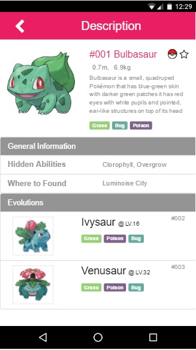

<<<<<<< 8a97766afa72d1a6d77ce90ce3075428349d3f41
# CodeChallenge2
DON'T PUSH TO THE MASTER
=======
# Hi, Welcome to Pokedex Challenge Part 2

# Hola, Bienvenido a el Desafío Pokedex Parte 2 !!

## Demo

ScreenShot of the Final Interface for Challenge #1

##Markup & Style

- [X] Mobile First (Mobile Only)
- [X] Use Less for CSS
- [X] Use Bootstrap3 for the UI

##DevOps

- [X] The Use of Automated Tasks to Compile, Compress and Debugg my App W/Gulp
- [X] Additionaly I Use Jade for my HTML MarkUp 
- [X] Less for CSS Compiled and Minified 
- [X] Added my Gulpfile.json, Package.json and Bower.json for easily install all needed Dependencies
>>>>>>> Updating codeChallenge2
